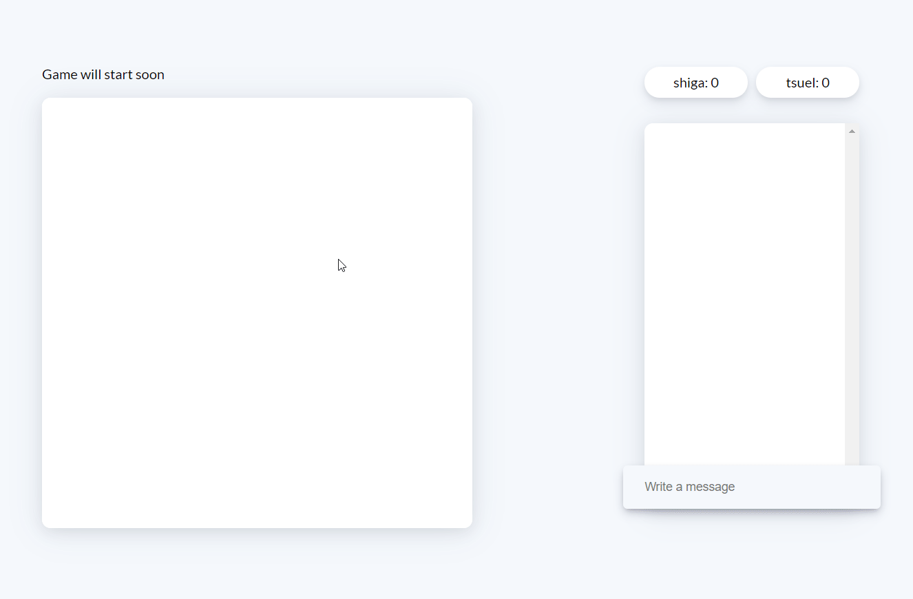
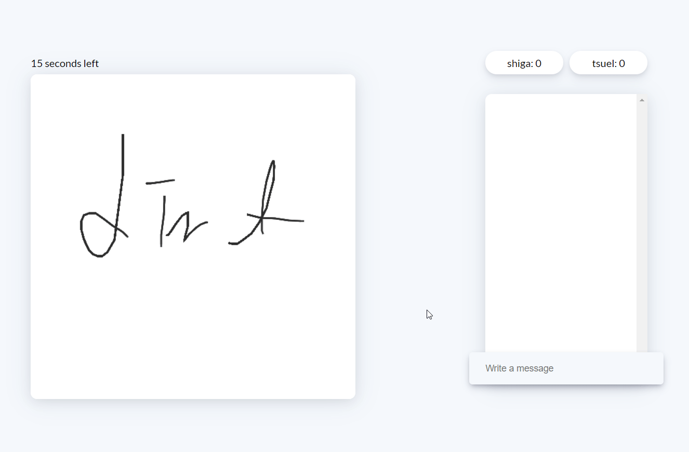

# Guess Mind

Realtime Drawing Game built with SocketIO, Gulp and Node

### Tech Stack

| Frontend |    Technology     | Description |
| :------: | :---------------: | :---------: |
|    01    |     VanillaJS     | Interaction |
|    02    |       SCSS        |    Style    |
|    03    | Gulp(Task Runner) |   Static    |

 

| Backend | Technology | Description |
| :-----: | :--------: | :---------: |
|   01    |   NodeJS   |  Run Time   |
|   02    | ExpressJS  |   Server    |
|   03    |  SocketIO  | Web Socket  |

### Event Subcription

| List |       Event        |       Direction       |         Discription         |
| :--: | :----------------: | :-------------------: | :-------------------------: |
|  01  |   handleNewUser    | socket.broadcast.emit |   ✅새로운 유저 이름 등록   |
|  02  | handleDisconneted  |        io.emit        |      ✅서버 연결 끊김       |
|  03  |    handleNewMsg    |        io.emit        |     ✅채팅 메시지 전달      |
|  03  |  handleBeganPath   | socket.broadcast.emit |   ✅마우스 x, y좌표 전달    |
|  03  | handleStrokedPath  | socket.broadcast.emit |       ✅그림판 그리기       |
|  03  |    handleFilled    | socket.broadcast.emit |       ✅그림판 채우기       |
|  03  | handlePlayerUpdate |        io.emit        |     ✅유저목록 업데이트     |
|  03  | handleGameStarted  |        io.emit        |  ✅게임 시작을 받는 메시지  |
|  03  | handleLeaderNotif  |        io.emit        |      ✅게임 리더 알림       |
|  03  |  handleGameEnded   |        io.emit        |  ✅게임 끝을 알리는 메시지  |
|  03  | handleGameStarting |        io.emit        | ✅게임 시작을 알리는 메시지 |

### Feature

- 유저 닉네임 등록

- 채팅창 구현

- 그림판 구현

- 점수판 구현

- 알림 메시지 구현

### Game Rules

- Leader Side

    
  리더는 그림을 그릴 수 있는 권한이 주어지는 반면에 채팅이 제한되어 있음. 
  게임시작 후 30초 내에 알림메시지로부터 주어진 단어를 그려야 한다. 

- User Side to Match the Picture

    
  그림을 맞추는 유저는 그림을 그릴 수 있는 권한이 제어되어 있으며 채팅창은 활성화 되어있다. 
  정답을 맞추면 게임이 즉시 종료되고 맞춘 유저의 점수가 올라간다. 
  게임이 종료되고 잠시 후, 다시 게임이 시작된다. 

### Do yourself!

Git this repository. You will need node and yarn installed globally on your device! 

1. `git clone https://github.com/ShigatsuEl/guess-mind.git`
2. `yarn install`
3. `yarn dev:server`
